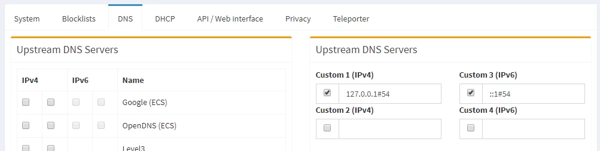

# ARMv7 docker container for dnscrypt-proxy.

Your secure and private DNS server on Raspberry Pi!

This container implements [dnscrypt-proxy](https://github.com/jedisct1/dnscrypt-proxy).
Just run this docker container on your Raspberry Pi.

Build docker
```
docker build -t ugeek/dnscrypt-proxy:2.0.39.arm .
```


## How to run

```
docker run -it -p 54:53/udp -p 54:53/tcp --name dnscrypt-proxy ugeek/dnscrypt-proxy:2.0.39.arm
```

After the container is running, configure your operating system or router to use address of your RPi as a DNS server.


# PiHole

